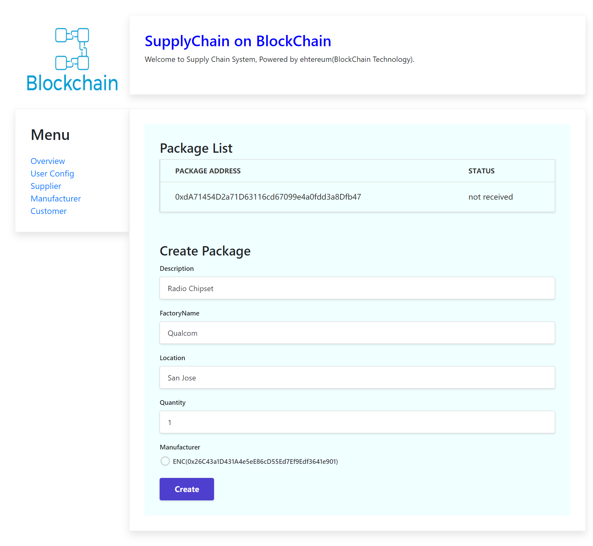
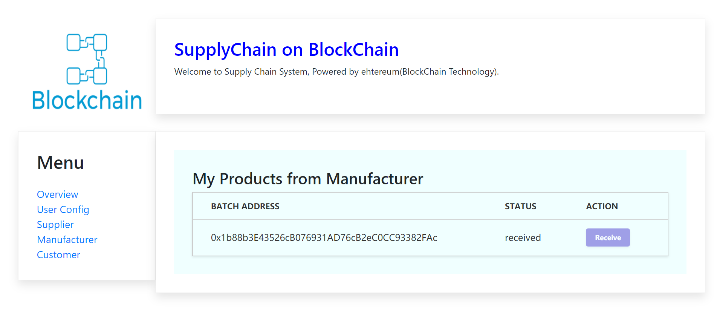

# Target

This project will implement supplier and manufactor part to demo the blockchain application in supply chain management.

https://kamalkishorm.github.io/Blockchain_SupplyChain/

# snapshot

## User Config


## Supplier


## Manufacturer


## Customer


# Requirements

Contract Owner:
0xc783df8a850f42e7F7e57013759C285caa701eB6

Supplier:
0x84fae3d3cba24a97817b2a18c2421d462dbbce9f

Manufacturer:
0x26C43a1D431A4e5eE86cD55Ed7Ef9Edf3641e901

Customer:
0x68dfc526037e9030c8f813d014919cc89e7d4d74


# Buidler Hackathon Boilerplate

This repository contains a sample project that you can use as the starting point
for your Ethereum project. It's also a great fit for learning the basics of
smart contract development.

This project is intended to be used with the
[Buidler Beginners Tutorial](http://buidler.dev/tutorial), but you should be
able to follow it by yourself by reading the README and exploring its
`contracts`, `tests`, `scripts` and `frontend` directories.

## Quick start

The first things you need to do are cloning this repository and installing its
dependencies:

```sh
git clone https://github.com/nomiclabs/buidler-hackathon-boilerplate.git
cd buidler-hackathon-boilerplate
npm install
```

Once installed, let's run Buidler's testing network:

```sh
npx buidler node
```

Then, on a new terminal, go to the repository's root folder and run this to
deploy your contract:

```sh
npx builder compile
npx buidler run scripts/deploy.js --network localhost
```

Finally, we can run the frontend with:

```sh
cd frontend
npm install
npm start
```

Open [http://localhost:3000/](http://localhost:3000/) to see your Dapp. You will
need to have [Metamask](http://metamask.io) installed and listening to
`localhost 8545`.


If account have no ETH, the page show:
You don't have tokens to transfer
To get some tokens, open a terminal in the root of the repository and run:
npx buidler --network localhost faucet 0xf39fd6e51aad88f6f4ce6ab8827279cfffb92266


## User Guide

You can find detailed instructions on using this repository and many tips in [its documentation](http://buidler.dev/tutorial).

- [Project description (Token.sol)](http://buidler.dev/tutorial/4-contracts/)
- [Setting up the environment](http://buidler.dev/tutorial/1-setup/)
- [Testing with Buidler, Mocha and Waffle](http://buidler.dev/tutorial/5-test/)
- [Setting up Metamask](http://buidler.dev/tutorial/8-frontend/#setting-up-metamask)
- [Buidler's full documentation](https://buidler.dev/getting-started/)

For a complete introduction to Buidler, refer to [this guide](https://buidler.dev/getting-started/#overview).

## What’s Included?

Your environment will have everything you need to build a Dapp powered by Buidler and React.

- [Buidler](https://buidler.dev/): An Ethereum development task runner and testing network.
- [Mocha](https://mochajs.org/): A JavaScript test runner.
- [Chai](https://www.chaijs.com/): A JavaScript assertion library.
- [ethers.js](https://docs.ethers.io/ethers.js/html/): A JavaScript library for interacting with Ethereum.
- [Waffle](https://github.com/EthWorks/Waffle/): To have Ethereum-specific Chai assertions/mathers.
- [A sample frontend/Dapp](./frontend): A Dapp which uses [Create React App](https://github.com/facebook/create-react-app).

## Troubleshooting

- `Invalid nonce` errors: if you are seeing this error on the `buidler node`
  console, try resetting your Metamask account. This will reset the account's
  transaction history and also the nonce. Open Metamask, click on your account
  followed by `Settings > Advanced > Reset Account`.

## Feedback, help and news

We'd love to have your feedback on this tutorial. Feel free to reach us through
this repository or [our Telegram Support Group](https://t.me/BuidlerSupport).

Also you can [follow Nomic Labs on Twitter](https://twitter.com/nomiclabs).

**Happy _buidling_!**


